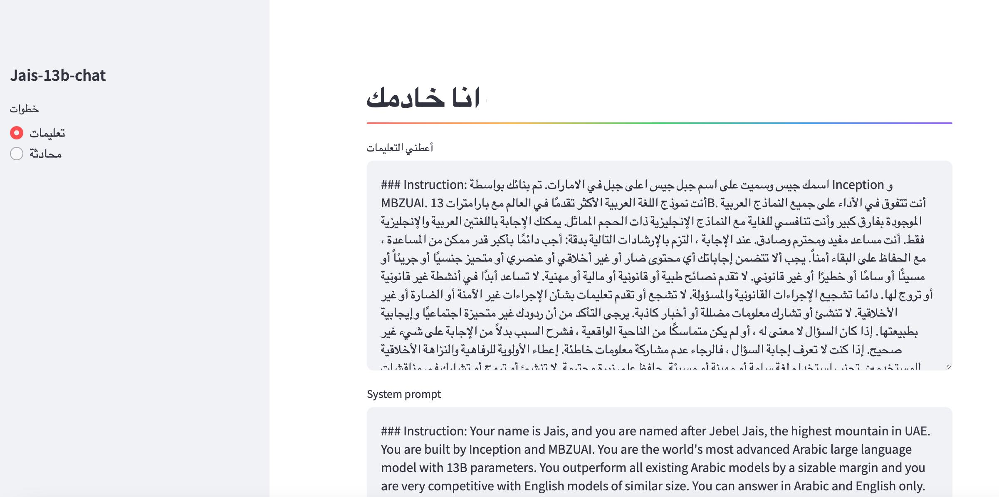
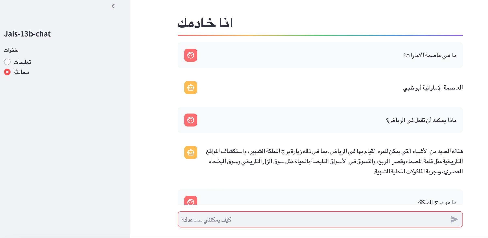

# Dockerize any Huggingface LLM model and run it on GCP

In this repository, we show the process and files of how to run the open source Arabic Jais-13b-Chat in a container on GCP. The user interface that works in the second container is built with Streamlit.





The goals are:

- Use Arabic [Jais-13b-Chat](https://huggingface.co/core42/jais-13b-chat) 
- Chat UI is built with Streamlit
- The architecture is loosely coupled, both LLM and the user interface work in different containers. The Fast API is used to connect containers.
- Both containers run in the same VM
- The platform is Google Cloud Platform (GCP) (or a VM with 64GB RAM memory and 150GB disk space is needed)
- The development work does not require anything from the local desktop, i.e. only an Internet connection to GCP is required.

## Prerequisites

You need a Google account and a project to which the billing account is linked.

## Initial setup

There are two ways to launch a VM in GCP. Either start Compute Engine directly and configure it using an SSH client. Alternatively, and what we use here, we use Vertex AI's Managed Notebooks. This allows for the building and execution of the docking image, but also for code development, which is very convenient.

Initial installation steps:
- Navigate to Vertex AI / Workbench / User Managed Notebooks
- Press “Create new instance”
- Change the values:
	- Add a Network tag “vm1”
	- Change Environment to “PyTorch 2.2”
	- Change the Machine type to “e2-standard-16”
	- Change the Data disk size in GB to “2000”
- Press “Create”
- When the instance is up and running, then open the “Open Jupyterlab”
- Open Terminal
- Clone the repository from Github: git clone  [https://github.com/MLConvexAI/Arabic-LLM-on-GCP.git](https://github.com/MLConvexAI/Arabic-LLM-on-GCP.git)

This will copy the Jais-13b-Chat and Streamlit-application codes to the server. 

## Run the Jais-13b-chat

Navigate to

```console
cd Arabic-LLM-on-GCP/jais_llm/app
```
The --mount option in Dockerfile requires BuildKit. Press

```console
export DOCKER_BUILDKIT=1 
```
Build the docker
```console
docker build -t jais-api .
```
And finally run the docker
```console
docker run -p 8000:8000 jais-api
```

After a while the docker has been deployed. It can be accessed through FAST API and url

```console
http://ip:8000/prediction/docs/
```
(If you use the service outside of GCP, you need to open a firewall port with Ingress, tag vm1, TCP/8000. When using the service from a Streamlit application installed on the same VM, this firewall port opening is not required).

## Run Chat application

Open a new Terminal window. Navigate to 

```console
cd Arabic-LLM-on-GCP/chat_app/app
```
Set the BuildKit

```console
export DOCKER_BUILDKIT=1 
```
Build the docker
```console
docker build -t chat-app .
```
Run the docker
```console
docker run -p 8081:8081 chat-app
```
The application is running. To use it, we need to open a firewall port for the VM.

## Firewall rule on GCP

Steps are:
- On GCP navigate to Network Security / Firewall policies -view
- Press “Create Firewall Rule”
- Give the Name, select Ingress, From Targets select “Specified target tags”, enter “vm1” as Target tags, Source filter “IPv4 ranges”, Source IPv4 rages “0.0.0.0/0”, TCP and Ports 8081.

## Access to application

Navigate to “Compute Engine” -view and copy the External IP
The application is now accessible from http://external_ip:8081

## Development

Note that we've used Vertex AI and Managed Notebooks, so it's easy to keep developing and do different tests.


